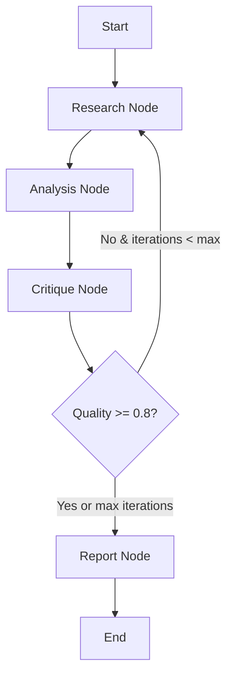

# LangGraph Research Agent with FriendliAI

A sophisticated multi-agent research system that demonstrates the power of LangGraph's stateful
workflows combined with FriendliAI's serverless LLM infrastructure.

## Overview

This example showcases how to build complex AI workflows using LangGraph's graph-based architecture
with FriendliAI as the LLM provider. The system orchestrates multiple specialized agents to conduct
comprehensive research on any topic.

## Key Features

### 🎯 LangGraph Capabilities Demonstrated

1. **Stateful Workflows**: Maintains research state across multiple iterations
1. **Conditional Branching**: Dynamically decides workflow paths based on quality scores
1. **Multi-Agent Orchestration**: Coordinates specialized agents (Researcher, Analyst, Critic)
1. **Iterative Refinement**: Automatically improves research quality through multiple passes
1. **Graph-based Architecture**: Clear, maintainable workflow definition

### 🤖 Agent Roles

- **Researcher Agent**: Gathers comprehensive information on the topic
- **Analyst Agent**: Synthesizes findings and identifies patterns
- **Critic Agent**: Evaluates research quality and suggests improvements
- **Reporter Agent**: Generates the final comprehensive report

### 📊 Workflow Process



## Installation

Set your FriendliAI token:

```bash
export FRIENDLI_TOKEN="your-friendli-token"
```

Install dependencies:

```bash
cd examples/langgraph-research-agent
uv sync
```

### Model

The system uses the latest Qwen model by default:

- **Model**: `Qwen/Qwen3-235B-A22B-Instruct-2507`

## Usage

### Start the Server

```bash
uv run main.py
```

The server will run on `http://localhost:8080`

### Conduct Research

```bash
# Basic research request
curl -X POST http://localhost:8080/research \
  -H "Content-Type: application/json" \
  -d '{
    "topic": "The impact of quantum computing on cryptography",
    "max_iterations": 3,
    "depth": "comprehensive"
  }'

# With streaming updates
curl -X POST http://localhost:8080/research \
  -H "Content-Type: application/json" \
  -d '{
    "topic": "The future of renewable energy",
    "max_iterations": 2,
    "stream": true
  }'
```

### Explain Workflow

```bash
curl -X POST http://localhost:8080/research/explain
```

## API Endpoints

### POST `/research`

Conduct comprehensive research on a topic.

**Request Body:**

```json
{
  "topic": "string",
  "max_iterations": 3,
  "depth": "standard",
  "stream": false
}
```

**Parameters:**

- `topic`: Research topic (required)
- `max_iterations`: Maximum research iterations (1-5, default: varies by depth)
- `depth`: Research depth with preset configurations:
  - `"quick"`: 1 iteration, 0.6 quality threshold
  - `"standard"`: 2 iterations, 0.75 quality threshold
  - `"comprehensive"`: 3 iterations, 0.85 quality threshold
- `quality_threshold`: Target quality score (0.1-1.0, default: varies by depth)
- `stream`: Enable real-time progress streaming

**Response:**

```json
{
  "topic": "string",
  "status": "completed",
  "report": "Comprehensive research report...",
  "findings": [...],
  "analysis": {...},
  "quality_score": 0.85,
  "timestamp": "2024-01-01T00:00:00Z"
}
```

### POST `/research/explain`

Get detailed explanation of the workflow architecture.

### POST `/callbacks/health`

Health check endpoint.

## Streaming Mode

When `stream: true`, the endpoint returns Server-Sent Events with real-time updates:

```javascript
const eventSource = new EventSource('/research');
eventSource.onmessage = (event) => {
  const data = JSON.parse(event.data);
  console.log(`Status: ${data.status}, Quality: ${data.quality_score}`);
};
```

## How It Works

### 1. Research Phase

The Researcher agent gathers information about the topic, exploring various aspects and collecting
relevant data.

### 2. Analysis Phase

The Analyst agent synthesizes the research findings, identifying patterns, connections, and key
insights.

### 3. Critique Phase

The Critic agent evaluates the research quality (0-1 score) and determines if more research is
needed.

### 4. Iteration Decision

- If quality score >= 0.8: Proceed to report generation
- If quality score < 0.8 and iterations < max: Return to research
- If max iterations reached: Proceed to report generation

### 5. Report Generation

The Reporter agent creates a comprehensive, well-structured final report.

## Advanced Features

### Quality Control

The system automatically evaluates research quality and iterates to improve results:

- Quality threshold: 0.8
- Automatic refinement based on critique
- Maximum iteration limit to prevent infinite loops

### State Management

LangGraph maintains complete workflow state:

- Research findings from all iterations
- Analysis results
- Critique feedback
- Quality scores
- Iteration tracking

### Real-time Updates

Stream mode provides live progress updates:

- Current node being executed
- Iteration count
- Quality scores
- Status messages

## Example Output

```markdown
# Research Report: Quantum Computing and Cryptography

## Executive Summary
Quantum computing poses both opportunities and challenges for cryptography...

## Key Findings
1. Current encryption methods vulnerable to quantum attacks
2. Post-quantum cryptography solutions emerging
3. Timeline for practical quantum computers: 10-15 years

## Detailed Analysis
[Comprehensive analysis based on multiple research iterations]

## Conclusions
The cryptographic landscape must evolve to address quantum threats...

## Recommendations
1. Begin transition to post-quantum algorithms
2. Implement hybrid classical-quantum solutions
3. Invest in quantum-resistant infrastructure
```

## Architecture Benefits

### Why LangGraph?

1. **Clear Workflow Definition**: Graph-based approach makes complex workflows readable
1. **State Management**: Built-in state handling across workflow nodes
1. **Conditional Logic**: Easy implementation of dynamic workflow paths
1. **Scalability**: Add new nodes and agents without restructuring
1. **Debugging**: Clear execution flow and state tracking

### Why FriendliAI?

1. **High Performance**: Fast inference for responsive workflows
1. **Cost Effective**: Serverless pricing model
1. **Reliable**: Consistent performance for production use
1. **Easy Integration**: OpenAI-compatible API

## Development

### Adding New Agents

```python
def expert_node(state: ResearchState) -> Dict[str, Any]:
    expert = ChatOpenAI(
        model=DEFAULT_MODEL,
        api_key=os.getenv("FRIENDLI_TOKEN"),
        base_url="https://api.friendli.ai/serverless/v1"
    )
    # Custom expert logic
    return state

workflow.add_node("expert", expert_node)
workflow.add_edge("critique", "expert")
```

### Customizing Quality Metrics

Modify the `critique_node` to implement custom quality evaluation:

- Fact checking
- Source validation
- Completeness assessment
- Bias detection

## License

MIT
